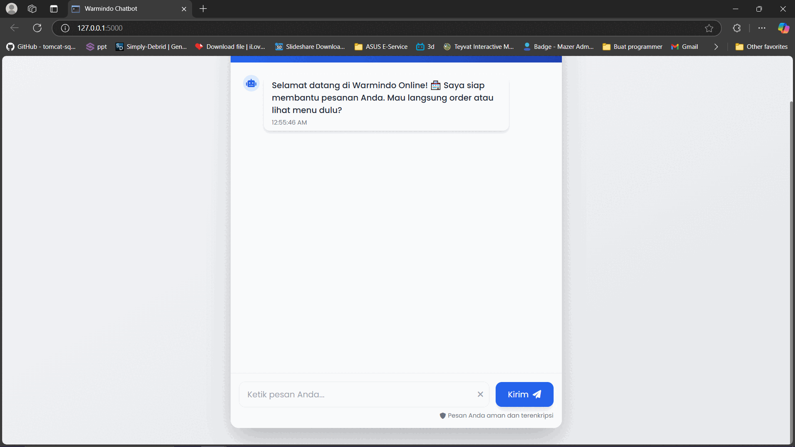
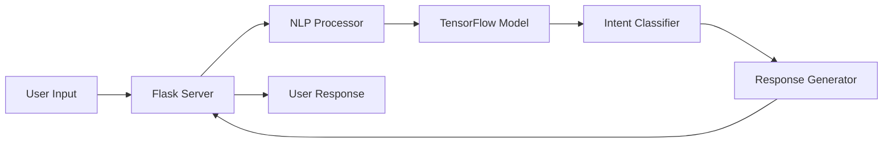

# 🤖 Chatbot Warmindo

[](https://choosealicense.com/licenses/mit/)
[](https://www.python.org/downloads/)
[](https://flask.palletsprojects.com/)
[](https://www.tensorflow.org/)

> Asisten virtual cerdas untuk warung makan Indonesia (Warmindo) yang membantu pelanggan dengan pemesanan dan informasi menu menggunakan Natural Language Processing.



## ✨ Fitur Utama

- 🧠 **Natural Language Understanding (NLU)**
  - Pemahaman konteks percakapan
  - Deteksi intent otomatis
  - Dukungan Bahasa Indonesia
  
- 💬 **Kemampuan Percakapan**
  - Respon cerdas dan kontekstual
  - Informasi menu dan harga
  - Bantuan pemesanan
  - FAQ otomatis

- 🌐 **Antarmuka Web Modern**
  - Desain responsi
  - Tampilan mobile-friendly

## 🚀 Quickstart

### Prasyarat

```bash
# Python 3.8 atau lebih tinggi
python --version

# Install dependensi
pip install -r requirements.txt
```

### Instalasi

1. Clone repositori
```bash
git clone https://github.com/FaturRahmanZaki/Chatbot-Warmindo
cd chatbot-warmindo
```

2. Setup environment
```bash
python -m venv venv
source venv/bin/activate  # Linux/Mac
# atau
venv\Scripts\activate  # Windows
```

3. Install dependensi
```bash
pip install -r requirements.txt
```

4. Jalankan aplikasi
```bash
python app.py
```

5. Buka browser dan akses `http://localhost:5000`

## 🏗️ Arsitektur Sistem



## 📁 Struktur Proyek

```
chatbot-warmindo/
├── app/
│   ├── __init__.py
│   ├── routes.py
│   ├── models/
│   │   └── chatbot_model.py
│   └── utils/
│       └── preprocessor.py
├── data/
│   ├── training.json
│   ├── responses.json
│   └── model/
│       ├── model.h5
│       ├── tokenizer.pkl
│       └── label_encoder.pkl
├── static/
│   ├── css/
│   └── js/
├── templates/
│   └── index.html
├── tests/
│   └── test_chatbot.py
├── .env.example
├── .gitignore
├── config.py
├── requirements.txt
└── README.md
```

## 🛠️ Teknologi yang Digunakan

- **Backend**
  - [Flask](https://flask.palletsprojects.com/) - Web framework
  - [TensorFlow](https://www.tensorflow.org/) - Machine learning
  - [NLTK](https://www.nltk.org/) - Natural language processing
  - [NumPy](https://numpy.org/) - Komputasi numerik

- **Frontend**
  - HTML5
  - CSS3
  - JavaScript
  - [Socket.IO](https://socket.io/) - Real-time communication

## 💡 Penggunaan

### Contoh Interaksi

```python
# Inisialisasi chatbot
from app.models.chatbot_model import WarmindoBot

bot = WarmindoBot()

# Contoh penggunaan
response = bot.get_response("Berapa harga mie goreng?")
print(response)
# Output: "Mie goreng kami dibanderol dengan harga Rp12.000"
```

### API Endpoints

| Endpoint | Metode | Deskripsi |
|----------|--------|-----------|
| `/` | GET | Halaman utama chatbot |
| `/api/chat` | POST | Endpoint untuk menerima pesan |
| `/api/menu` | GET | Mendapatkan daftar menu |

## 🧪 Testing

```bash
# Menjalankan unit tests
python -m pytest tests/

# Menjalankan dengan coverage report
pytest --cov=app tests/
```

## 📝 Konfigurasi

Salin `.env.example` ke `.env` dan sesuaikan:

```env
FLASK_ENV=development
DEBUG=True
SECRET_KEY=your-secret-key
MODEL_PATH=path/to/model
```

## 🔄 Workflow Pengembangan

1. Fork repositori
2. Buat branch fitur (`git checkout -b feature/AmazingFeature`)
3. Commit perubahan (`git commit -m 'Add some AmazingFeature'`)
4. Push ke branch (`git push origin feature/AmazingFeature`)
5. Buat Pull Request


## 🤝 Kontribusi

Kontribusi membuat komunitas open source menjadi tempat yang luar biasa untuk belajar, menginspirasi, dan berkreasi. Setiap kontribusi yang Anda berikan **sangat dihargai**.

1. Fork proyek ini
2. Buat branch fitur Anda
3. Commit perubahan Anda
4. Push ke branch
5. Buka Pull Request

Lihat [panduan kontribusi](./CONTRIBUTING.md) untuk detail lebih lanjut.

## 📄 Lisensi

Didistribusikan di bawah Lisensi MIT. Lihat [LICENSE](./LICENSE) untuk informasi lebih lanjut.

## 👥 Tim

- **Project Lead** - [@Fatur](https://github.com/FaturRahmanZaki)
- Lihat juga daftar [kontributor](https://github.com/username/chatbot-warmindo/contributors) yang berpartisipasi dalam proyek ini.

## 📬 Kontak

Nama Anda - [@ftrrahmanzk](https://x.com/FaturZaki) - email@example.com

Project Link: [https://github.com/FaturRahmanZaki/Chatbot-Warmindo](https://github.com/FaturRahmanZaki/Chatbot-Warmindo)

## 🙏 Pengakuan

- [Flask Documentation](https://flask.palletsprojects.com/)
- [TensorFlow Tutorials](https://www.tensorflow.org/tutorials)
- [NLTK Documentation](https://www.nltk.org/)

---

⭐️ Star repo ini jika membantu proyek Anda!